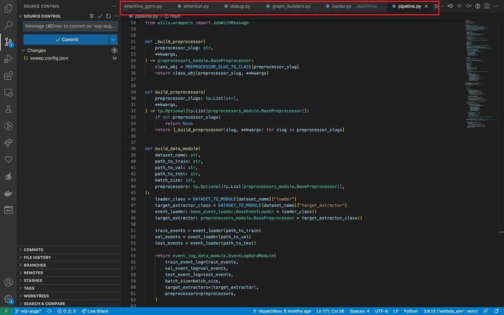
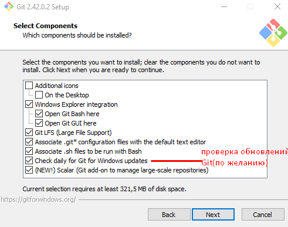
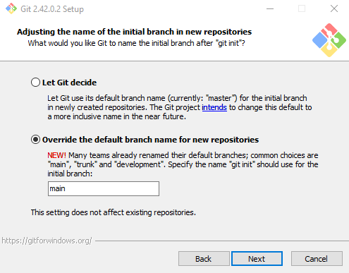
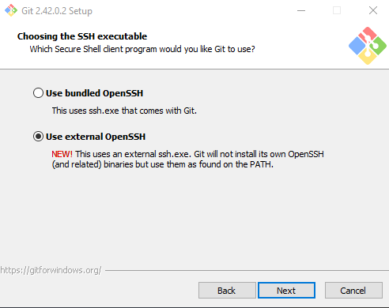
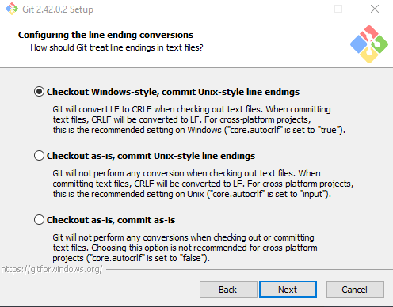
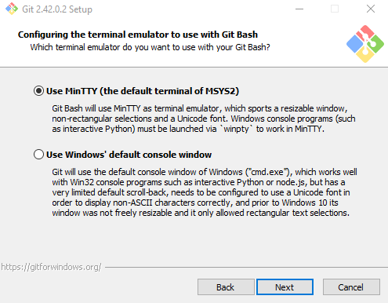

# Git. Краткое руководство для начинающих

## О руководстве / Введение / Общие сведения

## Начало работы с Git

### Установка VS Code на ОС Windows и знакомство с ним

**Для установки VS Code на ОС Windows следует:**

1. Скачать [программу для установки](https://code.visualstudio.com/).
1. Запустить скачанный файл и следовать инструкциям мастера установки.

**Для ознакомления с основными элементами интерфейса рекомендуется запустить VS Code и **

<p align="center">
   <figure>
    
    <figcaption>Интерфейс VS Code. Открытый рабочий проект</figcaption>
    </figure>
</p>

### Установка и настройка Git на ОС Windows

#### Установка Git

**Для установки Git на ОС Windows следует:**

1. Скачать [программу для установки](https://git-scm.com/downloads/win).
1. Запустить скачанный файл и перейти к установке.
1. Выбрать путь для установки.
1. Выбрать компоненты установки согласно рисунку 1.

   <p align="center">
      <figure>
        
        <figcaption> Рисунок 1 — Мастер установки Git. Выбор компонентов установки</figcaption>
      </figure>
   </p>

   
   <figcaption> Рисунок 1 — Мастер установки Git. Выбор компонентов установки</figcaption>
     
1. Оставить заданную по умолчанию папку меню **Пуск**.
1. Выбрать редактор кода, который будет использоваться в Git по умолчанию.
      > Рекомендуется выбрать VS Code в качестве редактора по умолчанию.
      >>Если VS Code не установлен на используемом компьютере, он не доступен для выбора в окне мастера установки Git.
        В таком случае [следует установить VS Code](#установка-vs-code-на-ос-windows-и-знакомство-с-ним), а затем вернуться к установке Git.
1. Определить имя начальной ветви репозитория. В настоящем руководстве выбрано и используется имя "main" (см. рисунок 2).
      >При создании нового репозитория его первая (основная) ветвь получит выбранное имя.
       По умолчанию Git использует имя "master"

   <p align="center">
    <figure>
    
        <figcaption>Рисунок 2 — Мастер установки Git. Определение имени начальной ветви репозитория</figcaption>
    </figure>
   </p>

1. Выбрать настройку переменной среды PATH, рекомендуемую мастером установки.
     > Переменная PATH содержит список директорий, в которых операционная система ищет исполняемые файлы.
     Если выбрать первый пункт, то переменная Path не будет изменена, а значит, среда разработки не увидит установленные Git-системы. В таком случае использовать инструменты Git можно будет только из командной строки Git Bush.
1. Последовательно выбрать настройки мастера установки, приведенные на рисунках 3–5.
   <p align="center">
    <figure>
    
    <figcaption>Рисунок 3 — Мастер установки Git. Выбор исполняемого файла SSH</figcaption>
    </figure>
   </p>

   <p align="center">
    <figure>
    
        <figcaption>Рисунок 4 — Мастер установки Git. Настройка преобразований в конце строки</figcaption>
    </figure>
   </p>

   <p align="center">
    <figure>
    
    <figcaption>Рисунок 5 — Мастер установки Git. Настройка эмулятора терминала для использования с Git Bash</figcaption>
    </figure>
   </p>

1. Выбрать стандартную стратегию работы команды `git pull` (по умолчанию).
1. Выбрать  Git Credential Manager для проверки учетных данных, чтобы использовать автоматическую аутентификации пользователя при выполнении операций с репозиторием.
1. Выбрать включение кэширования файловой системы, чтобы ускорить работу Git.
1. Оставить пустыми флажки включения экспериментальных функций.
1. Дождаться появления окна завершения установки.
1. Установить флажок запуска Git Bash и завершить установку.
1. Выполнить в терминале Git Bash команду `git –version`.

#### Первоначальная настройка Git


**Для установки Git на ОС Windows следует:**

### Создание репозитория

#### Создание репозитория в существующем каталоге

```bash
cd C:/Users/user/Project
git init
git add .
git commit -m "Initial project version"
git push origin main
```

#### Клонирование существующего репозитория

```bash
cd C:/Users/user/<папка, где будет хранится локальный репозиторий>
git clone <url>
```

### Внесение изменений в репозиторий / Работа с удаленным репозиторием

Добавление файла, отслеживание изменений (индексирование),
игнорирование изменений, коммит изменений, исправление коммита,
удаление и перемещение файла, запрос изменений с сервера (не решила куда это лучше поместить: в этот раздел или в раздел про совместную работу).

## Базовый сценарий работы

### Создание ветки

### Работа с веткой

Переключение между ветками, внесение изменений, слияние веток, удаление веток.

####

## Сценарии совместной работы

Пока не совсем понимаю какие разделы тут будут.

## Полезные материалы

Не определилась куда поместить данный раздел (в начале или в конце).
От этого зависит название раздела.

### Ключевые команды Git

### Распространенные ошибки и их устранение

### Критические ошибки / Необратимые ошибки
