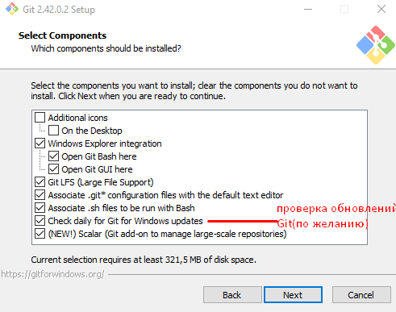

# Git. Краткое руководство для начинающих

## О руководстве / Введение / Общие сведения

## Начало работы с Git

### Установка и настройка Git на ОС Windows


Выбор компонентов установки Git

<p align="center">
   <figure>
    
    <figcaption>Выбор компонентов установки Git</figcaption>
    </figure>
</p>

### Установка VS Code на ОС Windows и знакомство с ним

**Для установки VS Code на ОС Windows следует:**

1. Скачать [программу для установки](https://code.visualstudio.com/).
1. Запустить скачанный файл и следовать инструкциям мастера установки.

**Для ознакомления с основными элементами интерфейса рекомендуется запустить VS Code и **

Насколько подробно?

### Создание репозитория

#### Создание репозитория в существующем каталоге

```bash
cd C:/Users/user/Project
git init
git add .
git commit -m "Initial project version"
git push origin main
```

#### Клонирование существующего репозитория

```bash
cd C:/Users/user/<папка, где будет хранится локальный репозиторий>
git clone <url>
```

### Внесение изменений в репозиторий / Работа с удаленным репозиторием

Добавление файла, отслеживание изменений (индексирование),
игнорирование изменений, коммит изменений, исправление коммита,
удаление и перемещение файла, запрос изменений с сервера (не решила куда это лучше поместить: в этот раздел или в раздел про совместную работу).

## Базовый сценарий работы

### Создание ветки

### Работа с веткой

Переключение между ветками, внесение изменений, слияние веток, удаление веток.

####

## Сценарии совместной работы

Пока не совсем понимаю какие разделы тут будут.

## Полезные материалы

Не определилась куда поместить данный раздел (в начале или в конце).
От этого зависит название раздела.

### Ключевые команды Git

### Распространенные ошибки и их устранение

### Критические ошибки / Необратимые ошибки